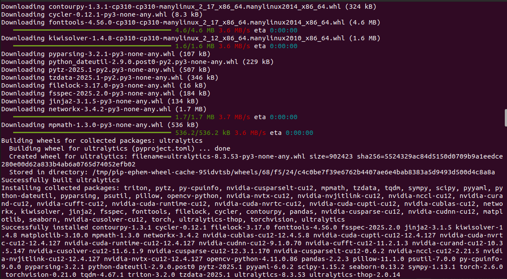
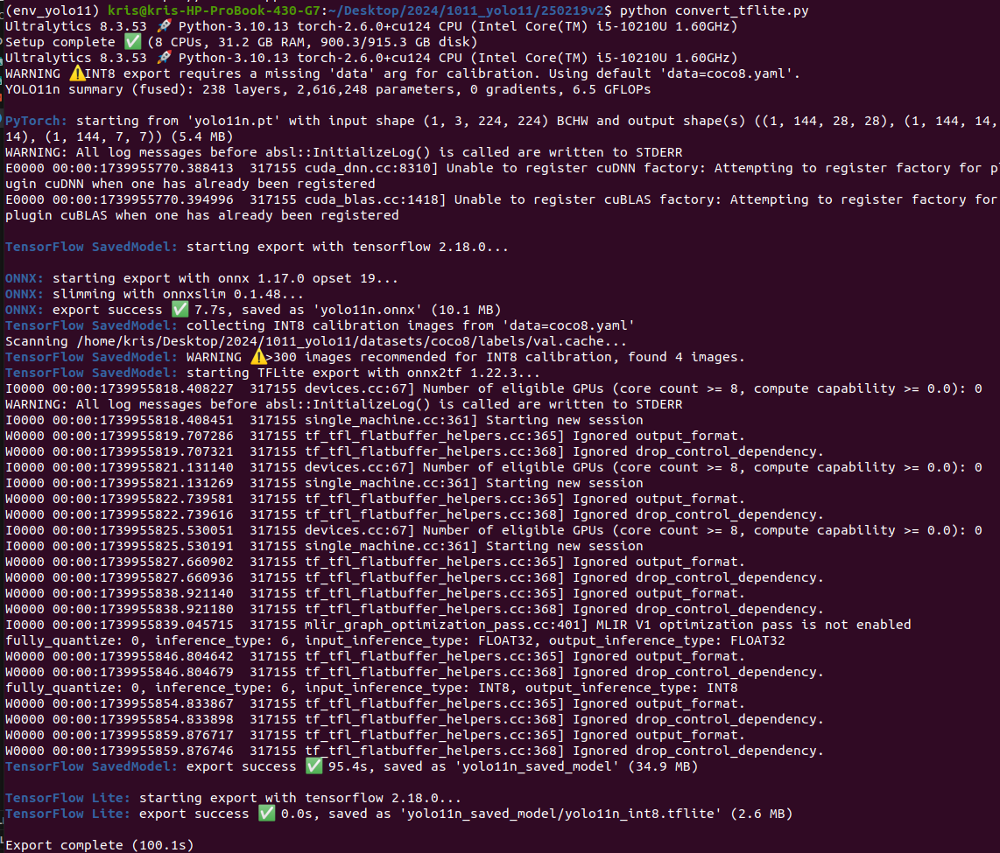
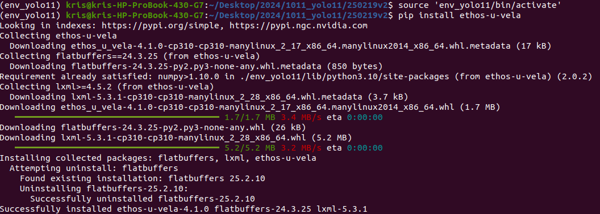
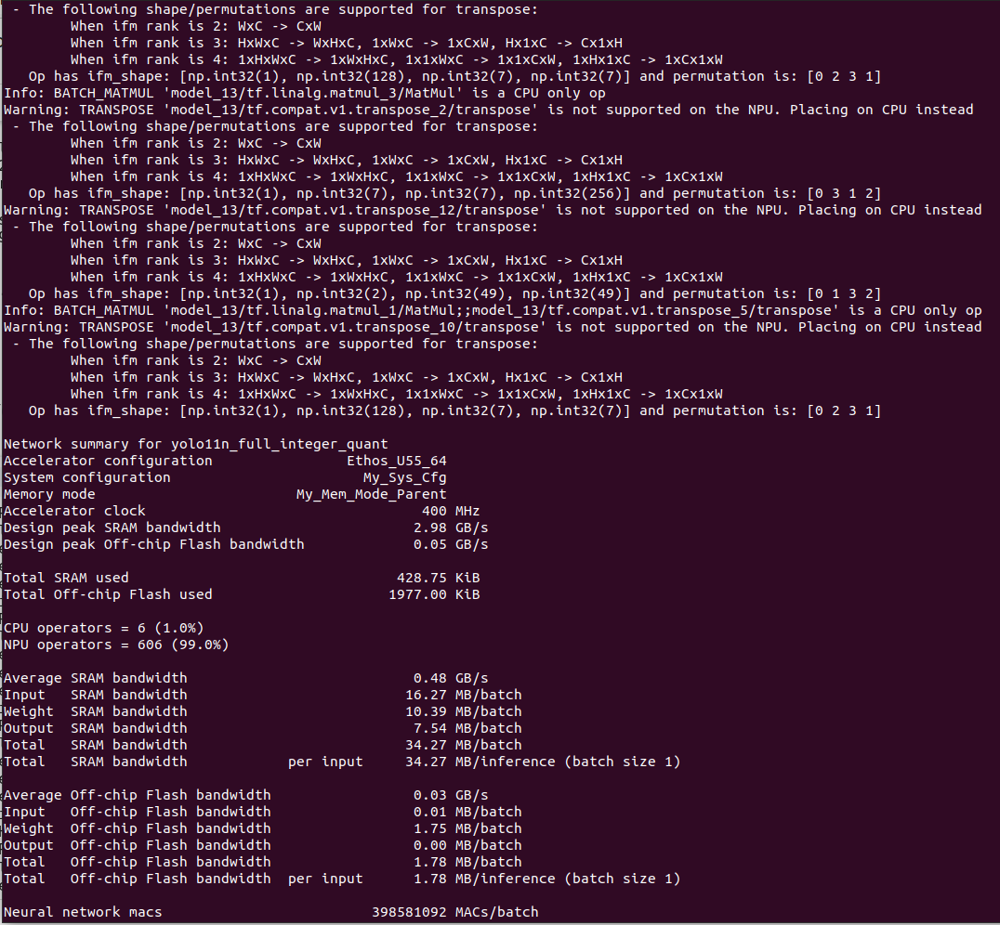
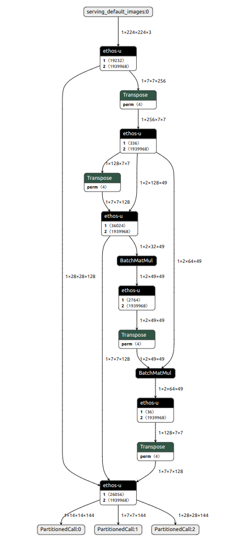
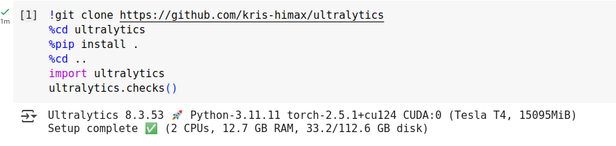
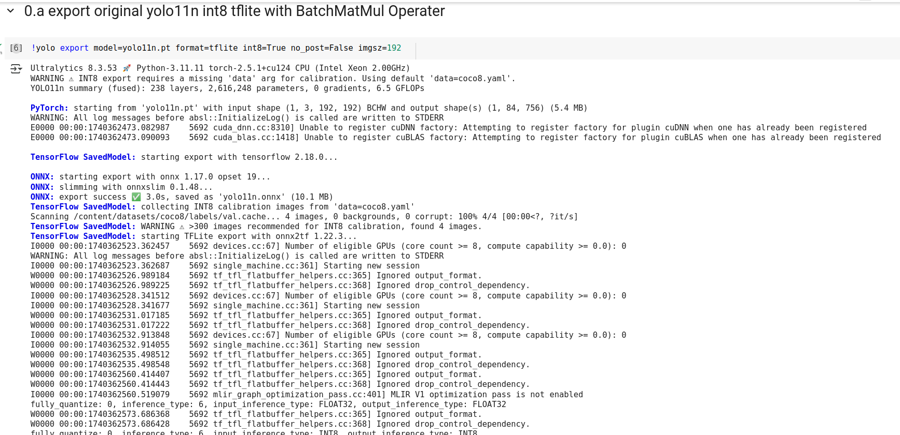
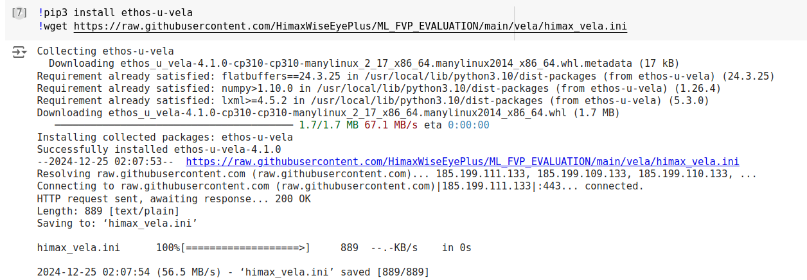
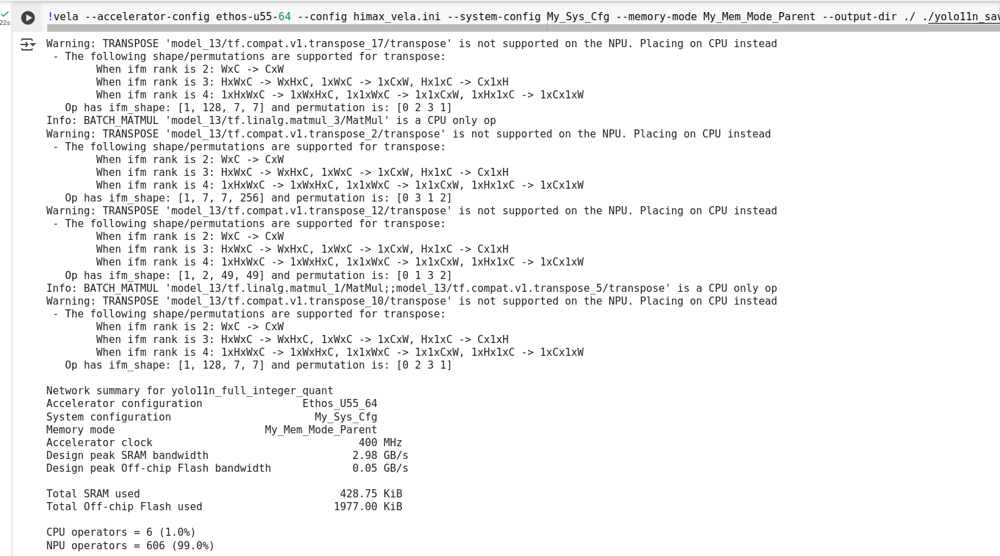
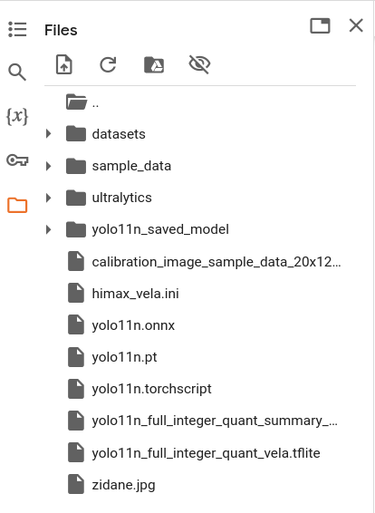

# YOLO11_on_WE2
This is the repository which can generate the YOLO11 model running on WE2.
Currently only support YOLO11 object detection task.
## Outline
You can choose to install it on your local PC or open it on Colab.
- [Install the Yolo11 environment at local PC](https://github.com/HimaxWiseEyePlus/YOLO11_on_WE2?tab=readme-ov-file#install-the-yolo11-environment-at-local-pc)
- [Open YOLO11_on_WE2_Tutorial.ipynb on Colab](https://github.com/HimaxWiseEyePlus/YOLO11_on_WE2?tab=readme-ov-file#open-yolo11_on_we2_tutorialipynb-on-colab)

## Install the Yolo11 environment at local PC
- The package has been tested in Ubuntu 20.04 LTS environment.
#### Clone repository
```
git clone https://github.com/HimaxWiseEyePlus/YOLO11_on_WE2
cd YOLO11_on_WE2
```
#### Pre-requirement
```
sudo apt install python3.10-dev
```
#### Create python3.10 virtual environment, you should only do one time
```
python3.10 -m venv --without-pip  env_yolo11
wget https://bootstrap.pypa.io/get-pip.py
source 'env_yolo11/bin/activate'
which python
python --version
which pip
python get-pip.py
###tensorflow-cpu or tensorflow
pip install tensorflow-cpu
```
#### Install ultralytics (yolo11) python package at python3.10 virtual environment
```
source 'env_yolo11/bin/activate'
git clone https://github.com/kris-himax/ultralytics
cd ultralytics
pip install .
cd ..
```


#### convert to the yolo11n tflite
-  convert to the yolo11n tflite `without post-proccessing`, you should remember to set `no_post=True`
-  convert to the `full` yolo11n tflite, you should remember to set `no_post=False`
```
python examples/convert_tflite.py
```


#### Install vela
```
pip install ethos-u-vela
wget https://raw.githubusercontent.com/HimaxWiseEyePlus/ML_FVP_EVALUATION/main/vela/himax_vela.ini
```


#### convert tflite to vela tflite format
```
vela --accelerator-config ethos-u55-64 --config himax_vela.ini --system-config My_Sys_Cfg --memory-mode My_Mem_Mode_Parent --output-dir ./ ./[your path about yolo11n full integer quant tflite file]

###for example
vela --accelerator-config ethos-u55-64 --config himax_vela.ini --system-config My_Sys_Cfg --memory-mode My_Mem_Mode_Parent --output-dir ./ ./yolo11n_saved_model/yolo11n_full_integer_quant.tflite
```


- The output int8 vela tflite model which you can open by [netron](https://netron.app/).



#### Yolo11n object detection on WE2
- You can reference [here](https://github.com/HimaxWiseEyePlus/Seeed_Grove_Vision_AI_Module_V2/tree/main/EPII_CM55M_APP_S/app/scenario_app/tflm_yolo11_od) to put the Yolo11n object detection on WE2.

[Back to Outline](https://github.com/HimaxWiseEyePlus/YOLO11_on_WE2?tab=readme-ov-file#outline)

## Open YOLO11_on_WE2_Tutorial.ipynb on Colab
- You cust click following button.
[](https://colab.research.google.com/github/HimaxWiseEyePlus/YOLO11_on_WE2/blob/main/examples/YOLO11_on_WE2_Tutorial.ipynb)

- Just step by step execute each block
#### Setup


#### Export YOLO11n int8 tflite by pretrained weight [yolo11n.pt](https://github.com/ultralytics/assets/releases/download/v8.3.0/yolo11n.pt)
- You can also replace the `*.pt` file by your own file.
- You can export original yolo11n int8 tflite with BatchMatMul Operater by `0.a` and skip `0.b`.

- You can export yolo11n int8 tflite with BatchMatMul Operater without post-proccessing by `0.b` with `no_post=True`.


#### Install vela compiler


#### Convert Yolo11n int8 tfltie to vela model which can run on WE2
- Be careful about the Total SRAM size. The Total SRAM size at WE2 is only 2MB.



#### Download the YOLO11n int8 tflite model
- download the `yolo11n_full_integer_quant_vela.tflite` file


#### Yolo11n object detection on WE2
- You can reference [here](https://github.com/HimaxWiseEyePlus/Seeed_Grove_Vision_AI_Module_V2/tree/main/EPII_CM55M_APP_S/app/scenario_app/tflm_yolo11_od) to put the Yolo11n object detection on WE2.

[Back to Outline](https://github.com/HimaxWiseEyePlus/YOLO11_on_WE2?tab=readme-ov-file#outline)