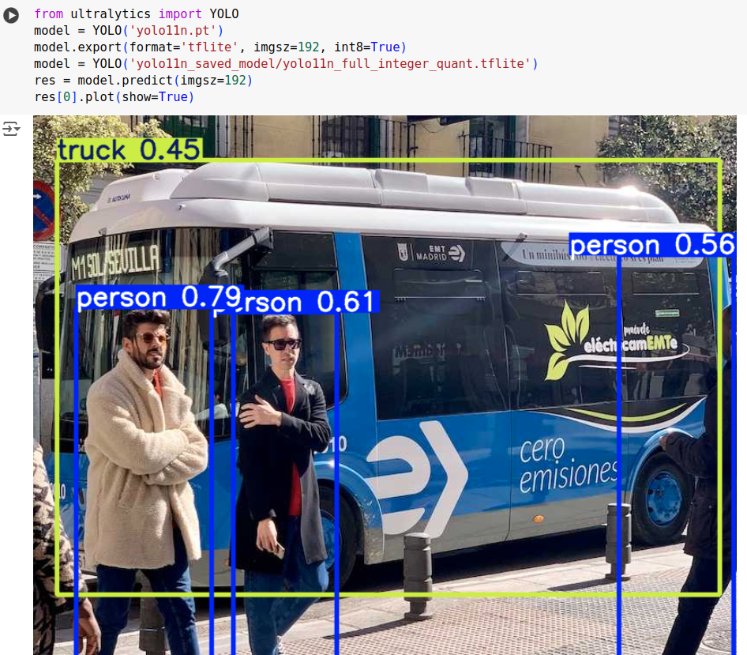

# YOLO11_on_WE2
This is the repository which can generate the YOLO11 model running on WE2.
Currently only support YOLO11 object detection task.

## Open YOLO11_on_WE2_Tutorial.ipynb in Colab
- You cust click following button.

- Just step by step execute each block
#### Setup

#### Export YOLO11n int8 tflite with BatchMatMul Operater by pretrained weight [yolo11n.pt](https://github.com/ultralytics/assets/releases/download/v8.3.0/yolo11n.pt)
- You can also replace the `*.pt` file by your own file.

#### Install vela compiler

#### Convert Yolo11n int8 tfltie to vela model which can run on WE2
- Be careful about the Total SRAM size. The Total SRAM size at WE2 is only 2MB.

#### Download the YOLO11n int8 tflite model
- download the `yolo11n_full_integer_quant_vela.tflite` file

#### Yolo11n object detection on WE2
- You can reference [here](https://github.com/HimaxWiseEyePlus/Seeed_Grove_Vision_AI_Module_V2/tree/main/EPII_CM55M_APP_S/app/scenario_app/tflm_yolo11_od) to put the Yolo11n object detection on WE2.